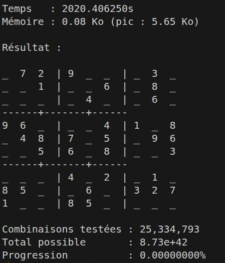
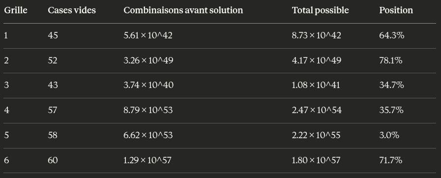
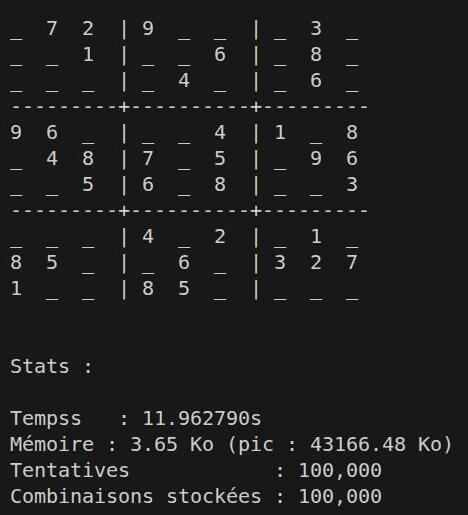
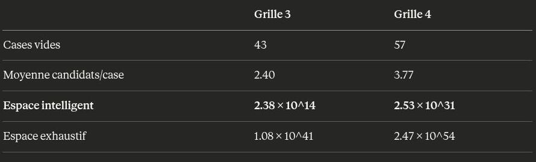

# Sudoku-Solver

## Un résolveur de Sudoku en Python

### Comparaison des différents algorithmes

**1) La force brute**   

Nous avons choisi de créer des variations autour de l'algorithme de force brute, afin de créer une sorte de progression dans les tentatives de résolution, et ce jusqu'à la plus rapide des résolutions (backtracking).

Comme soulevé dans l' autre document de synthèse (READAME_contexte.md), l'utilisation de deepcopy, nécessaire à l'application de certains algorithmes, représente une coût mémoire.   
Celui-ci est inhérent à l'architecture de cet algorithme. En effet, chaque tentative étant indépendante, une copie fraîche est nécessaire. C'est une limite structurelle par rapport au backtracking qui travaille en place.

**1.1) Bruteforce exhaustive**

Fonctionnement : remplissage des case de la valeur la plus basse autorisée, puis incrémentation de 1 à chaque tentatives. Les règles du Sudoku soont appliquées sur la grille remplie.   
Dans ce contexte, nous avons implémenté une condition d'arrêt à 100000 (cent mille) tentatives.  
Nombre de combinaisons possibles pour 45 cases : 9⁴⁵ soit 8,73 *10⁴² solutions. 
ValeurCombinaisons à tester :8.73 × 10^42   Vitesse du PC : 42 517 551 combinaisons/heure   
Temps nécessaire : 2.05 × 10^35 heures soit2.34 × 10^31 années.   
Âge de l'univers : 1.38 × 10^10 années   
Ratio : 1.70 × 10^21 fois l'âge de l'univers
Résultat : aucune grille résolvable.   

Voici un exemple avec un temps de 2020 secondes, soit un peu plus de 33 minutes : 
   

Les valeurs sont identiques pour les 6 grilles, elles sont irresolvables dans le temps humain :

   

**1.2) Bruteforce exhaustive aléatoire à mémoire**

Le principe de cet algorithme est le même que le précédent, à savoir le test de toutes le combinaisons possibles.
Cependant, à la différence de bruteforce exhaustive, les combinaisons sont tirées au hasard et mises en mémoire afin de ne pas être réutilisées lors du test de validation (qui n'a jamais imaginé de gagner au loto en prenant en compte les combinaisons déjà sorties ?)   
Par ailleurs on constate une très grosse utilisation de la mémoire (plus de 43Mo pour 33 minutes, cela représente environ 1,83 Go pour 24h).

Exemple :    

**1.3) Bruteforce aléatoire à mémoire**

Le principe de cet algorithme est de tester toutes les combinaisons possibles, celles ci étant uniquement constituées des candidats possibles pour chaque cases.
Il peut y avoir de grandes différences de temps  de traitement, de relativement court à astronomiquement long. Ceci est différencié par la complexité exponentielle : plus il y  a de cases vides et plus le nombre de candidats possibles sont élevés, donc plus le temps de résolution est grand. Dans notre contexte, les grilles 1 à 3 sont résolues, en revanche à  partir de la grille 4, le temps demandé est très long.

   

***Complexité de la force brute aléatoire à mémoire :***    
Chaque tentative parcourt les k cases vides et calcule les candidats valides pour chacune :
1 tentative = k cases × vérification des 3 règles
            = k × (9 + 9 + 9) opérations
            = O(k)   

Pour max_tentatives T :
Complexité totale = T × O(k) = O(T × k)
Avec T = 100 000 et k = 45 :
100 000 × 45 = 4 500 000 opérations
   

**2) Le backtracking**

Dans ce projet, on a utilisé l’algorithme de backtracking pour résoudre des grilles de Sudoku. Le backtracking est une méthode de recherche systématique qui construit progressivement une solution et revient en arrière dès qu’une contradiction est détectée. Concrètement, l’algorithme remplit la grille case par case, teste les chiffres possibles en respectant les contraintes du Sudoku (lignes, colonnes et blocs), puis annule un choix dès qu’aucune valeur valide n’est disponible pour la suite.   

***Complexité algorithmique du backtracking :***   
Ce n'est pas calculable avant la présentation de la grille, car la complexité algorithmique varie en fonction de la grille : pour K cases vides la complexité serait au maximum de o(9^k). Cependant, avec le backtracking, tout l'espace de k n'est pas exploré.   
Exemple pour les grilles 1 et 6 :    
k varie entre 47 et 60 cases vides. 
Cependant, le backtracking n'explore qu'une fraction infime de l'espace théorique :

Grille 1 : 307 opérations sur 8.73 × 10^42 possibles pourrésoudre la grille,
Grille 6 : 445 778 opérations sur 1.80 × 10^57 possibles pour résoudre la grille.

**2.1) Le Backtracking classique**

Le backtracking classique est une méthode de résolution qui construit une solution progressivement, en testant chaque possibilité l'une après l'autre. À chaque étape, si le choix courant ne respecte plus les contraintes du problème, on revient en arrière pour essayer une autre option.

Dans le cas du Sudoku, on choisit une case vide, on essaie un chiffre possible, puis on vérifie si la grille reste valide. Si ce n’est pas le cas, on annule le choix précédent et on teste un autre chiffre ; sinon, on continue jusqu’à remplir toute la grille.

**2.3) Le backtracking amélioré**

Pour améliorer l'efficacité du backtracking classique, on a implémenté l'heuristique MRV (Minimum Remaining Values) : au lieu de choisir la première case vide rencontrée, on sélectionne systématiquement la case ayant le moins de valeurs possibles. Cette case "la plus contrainte" est traitée en priorité, car un mauvais choix y provoque une contradiction plus rapidement, réduisant ainsi la taille de l'arbre de recherche.

Cette optimisation diminue fortement le nombre total d'essais (mesuré par le compteur) et accélèrent la résolution, particulièrement sur les grilles de Sudoku les plus difficiles.

### Conclusion :

Cette étude comparative met en évidence l’efficacité des algorithmes de backtracking face aux approches de force brute. On observe que les variantes de force brute (exhaustive, aléatoire avec/sans mémoire) se révèlent pratiquement inutilisables, même avec 100 000 tentatives, en raison de leur complexité exponentielle (9⁴⁵ combinaisons possibles) et du coût mémoire lié aux copies multiples de la grille.

Différence principale : la force brute teste toutes les combinaisons sans exploiter les contraintes et nécessite une copie de la grille à chaque essai. Le backtracking classique teste progressivement et revient en arrière dès une contradiction, en travaillant directement sur la grille.

L’optimisation avec le MRV accentue cette supériorité :on priorise les cases les plus contraintes.

Ces améliorations réduisent fortement le nombre d’essais et le temps d’exécution. Le backtracking optimisé s’impose comme la solution correcte, efficace et réaliste.

